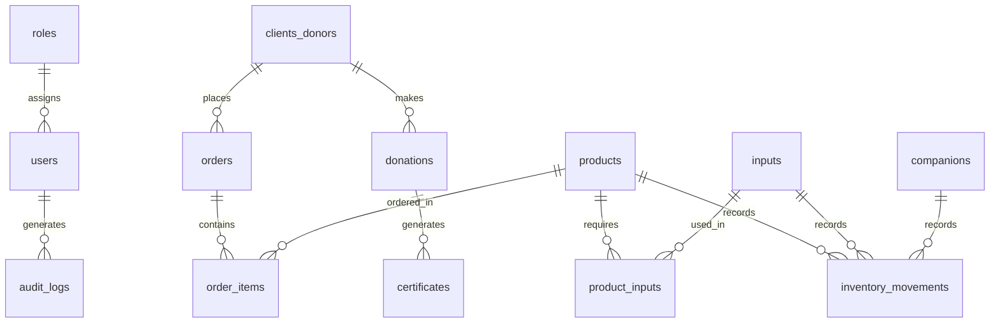

# Desglose Técnico de Estimación por Entregas - Propuesta 2
## Cliente: Fundación Infantil Santiago Corazón
## Consultor/Dev: Daniel Jaime Florez Aguirre
*   **Plazo Total:** 5 Meses (20 Semanas)
*   **Stack:** Angular | Node.js (NestJS/Express) o Python (FastAPI) | PostgreSQL Dedicado

Este documento detalla el plan de entregas y el alcance técnico de cada fase, especificando el **diseño de base de datos**, **endpoints de la API**, **módulos de Angular**, **pruebas de aceptación** e **integraciones del inventario** en cada una de las 5 entregas del proyecto.

---

## 1. Mapa General de Base de Datos (PostgreSQL)
A continuación, se define el esquema relacional que se implementará y poblará a lo largo de las entregas:



---

## 2. Viabilidad y Análisis de Reemplazar Shopify por E-commerce Propio
Reemplazar Shopify por una tienda pública propia es **técnicamente viable**, pero tiene un impacto significativo en el alcance y los plazos. A continuación, se presenta un análisis comparativo para la toma de decisiones:

### Comparativo: Integrar Shopify vs. Tienda Propia a Medida

| Criterio | Integrar Shopify (Original) | Reemplazar Shopify (Desarrollo Propio) |
| :--- | :--- | :--- |
| **Tiempo de Desarrollo** | **Bajo:** Se usa la API/Webhooks de Shopify para recibir pedidos ya procesados. | **Alto (+8 a 10 semanas):** Requiere crear catálogo público, carrito, pasarela de pago, cupones, etc. |
| **Complejidad y Seguridad** | **Baja:** Shopify gestiona la seguridad del checkout (PCI-DSS) y disponibilidad del servidor. | **Alta:** El servidor propio debe ser seguro y robusto para gestionar transacciones de pago. |
| **Administración del Catálogo** | Interfaz nativa de Shopify (muy amigable para el usuario). | Debe desarrollarse un panel de administración a medida para subir fotos, tallas, variantes, etc. |

### Alternativas Recomendadas para la Venta Online
*   **Opción A (Recomendada - Mantener Shopify + API):** Mantener Shopify para la tienda pública y conectar los pedidos automáticamente al backend corporativo (PostgreSQL) usando Webhooks para la administración interna de inventario, CRM y certificados.
*   **Opción B (Tienda Headless):** Tienda pública en Angular consumiendo la API de Shopify.
*   **Opción C (Desarrollo Propio Completo):** Eliminar Shopify y desarrollar el e-commerce a medida. Requiere **incrementar el plazo del proyecto en 2 meses adicionales**.

---

## 3. Mapa de Arquitectura Corporativa (Con PostgreSQL Propio y Angular)

```mermaid
graph TD
    subgraph Frontend Público (Donantes y Compradores)
        ShopifyStore[Tienda Shopify / Checkout Seguro]
    end

    subgraph Plataforma Central (Servidor Propio / Nube)
        AngularAdmin[Panel Admin Angular] <-->|Rest API con JWT| API[API Backend NestJS / FastAPI]
        API <-->|Conexión Segura SQL| DB[(PostgreSQL Dedicado)]
        
        subgraph Lógica del Backend
            AuthService[Autenticación Custom JWT]
            RoleGuard[Control de Accesos RBAC]
            CronJobs[Tareas Programadas de Backups]
        end
    end

    subgraph Integraciones y Notificaciones
        ShopifyStore -->|Webhook: Pedido Creado| API
        Wompi[Wompi / PayU / Paypal] -->|Webhook: Pagos| API
        API -->|Notificaciones| WhatsApp[WhatsApp Business API]
        API -->|Envío de Certificados| SMTP[Servicio de Correo]
    end
    
    Access[(Access Histórico)] -->|Migración Única ETL| DB
```

---

## 4. Plan de Entregas y Hitos Técnicos (Roadmap de 20 Semanas)

El proyecto se estructura en **5 entregas funcionales**, organizadas cronológicamente para evitar cuellos de botella de dependencias y optimizar la dedicación de un solo desarrollador:

### Entrega 1: Consolidación de Bases de Datos, Migración de Access y Ventas Manuales (Semanas 1 a 4)
*   **Alcance:**
    *   Setup de PostgreSQL y modelado del esquema de datos consolidado (tablas para Clientes, Beneficiarios, Voluntarios, Proveedores, Productos, Insumos, Pedidos, Usuarios y Seguridad).
    *   Módulo de seguridad con autenticación JWT y roles de usuario (RBAC).
    *   Ejecución del script ETL para migrar la base de datos histórica de Access a las tablas consolidada de PostgreSQL.
    *   Formulario de gestión de clientes (CRM) y registro manual de pedidos de tienda física (reemplazo de la antigua **APP Diana - Fase 1**).
    *   Exportador de transacciones contables formateadas a CSV para World Office.
*   **Entregable:** Base de datos corporativa completa e instanciada. Panel administrativo inicial en Angular con login seguro, buscador de clientes migrados, ingreso manual de órdenes y descarga de plantilla de exportación contable.
*   **Criterio de Aceptación:** Toda la base de datos unificada del sistema está modelada y creada. El histórico de Access está completamente migrado. Se ingresan pedidos manuales de la tienda física y se exporta el archivo contable CSV para World Office con éxito.

### Entrega 2: Automatización de Ingresos, Motor de Certificados y Dashboard de Monitoreo (Semanas 5 a 8)
*   **Alcance:**
    *   Endpoints de captura de Webhooks de Shopify para pedidos web en tiempo real.
    *   Webhooks de pasarelas de pago principales (Wompi y PayU) para donaciones y compras.
    *   Setup de cola de tareas asíncronas en segundo plano (BullMQ + Redis) para generación de PDF.
    *   Motor de generación automatizada de certificados firmados en PDF y almacenamiento en la nube (S3/R2).
    *   Envío automatizado de correos de agradecimiento por SMTP con el certificado adjunto.
    *   Desarrollo de un **Tablero de Monitoreo Inicial** en Angular para ver en tiempo real ingresos de Shopify/Wompi/PayU.
*   **Entregable:** Sistema automático de procesamiento de pagos. Panel de descargas de certificados y pantalla de estadísticas e ingresos en tiempo real.
*   **Criterio de Aceptación:** Una transacción de pago simulada crea el cliente y la orden en segundos, genera el certificado PDF en segundo plano y envía el correo. El operador cuenta con una vista inicial en Angular para monitorear las transacciones y estadísticas básicas acumuladas.

### Entrega 3: Fichas de Beneficiarios, WhatsApp API y Dashboard Diana (Semanas 9 a 12)
*   **Alcance:**
    *   Pantallas CRUD completas en Angular para la gestión de Niños Patrocinados (Beneficiarios).
    *   Tablero de control de órdenes en tiempo real (reemplazo de la antigua **APP Diana - Fase 2**) con control interactivo de estados de despacho.
    *   Integración con la API Cloud de WhatsApp Business para notificaciones transaccionales automáticas (estados de pedido y enlaces de certificados).
    *   Pasarela de pago PayPal y reportes financieros integrados con gráficos interactivos (reemplazo de Looker Studio).
*   **Entregable:** Dashboard de control de beneficiarios, control de envíos operativo de Diana, notificaciones activas de WhatsApp, pasarela PayPal y gráficos financieros en tiempo real.
*   **Criterio de Aceptación:** El personal puede gestionar fichas de niños patrocinados, cambiar el estado de un pedido notifica automáticamente por WhatsApp con su guía de transporte, y las métricas financieras se actualizan instantáneamente.

### Entrega 4: Fichas de Voluntarios, Segmentación Avanzada y Geolocalización (Semanas 13 a 16)
*   **Alcance:**
    *   Pantallas CRUD en Angular para el control y asignación de Voluntarios.
    *   Query Builder interno en Postgres para segmentar donantes/clientes (reemplazo de Databricks).
    *   Geocodificación espacial de direcciones a coordenadas puntuales (latitud/longitud).
    *   Mapa interactivo Leaflet de calor y clusters mostrando impacto de donaciones por comunas/barrios.
*   **Entregable:** Módulo de voluntarios, constructor de segmentos CRM exportables y mapa de calor espacial integrado.
*   **Criterio de Aceptación:** Se gestionan las hojas de vida de voluntarios, el director puede segmentar donantes activos y visualizarlos agrupados por comunas en el mapa interactivo de Angular de manera ágil.

### Entrega 5: Fichas de Proveedores, Inventario Inteligente y Ajustes Transaccionales (Semanas 17 a 20)
*   **Alcance:**
    *   Pantallas CRUD para Proveedores e Inventario avanzado de existencias (insumos, acompañantes y recetas).
    *   Control de stock mínimo, alertas visuales en la app y registro de movimientos/ajustes.
    *   Lógica de descuento transaccional concurrente (ACID) en Postgres para restar stock de insumos automáticamente en pedidos Shopify/físicos evitando stock negativo.
    *   Cron jobs de copias de seguridad de la base de datos subidas a la nube, paso definitivo a producción con SSL y capacitaciones finales.
*   **Entregable:** Módulo de proveedores e inventarios interactivo, aplicación completa al 100% en producción, manuales técnicos y capacitación al personal.
*   **Criterio de Aceptación:** Una venta efectuada descuenta proporcionalmente las materias primas del inventario según su receta de forma segura e integral. Firma del acta de entrega.

---

## 5. Matriz de Cronograma y Control Técnico

| Entrega | Semana Límite | Hito Técnico de Aceptación |
| :---: | :---: | :--- |
| **1** | Semana 4 | Consolidación de base de datos unificada + Migración completa de Access + Formulario APP Diana + CSV World Office. |
| **2** | Semana 8 | Automatización de Shopify y pasarelas (Wompi/PayU) + Cola de certificados PDF en la nube + SMTP automático. |
| **3** | Semana 12 | Fichas de Beneficiarios + Dashboard APP Diana (pedidos) + WhatsApp API + PayPal + Gráficos financieros en tiempo real. |
| **4** | Semana 16 | Fichas de Voluntarios + Segmentador avanzado Postgres + Geolocalización y mapa Leaflet por comunas. |
| **5** | Semana 20 | Fichas de Proveedores e Inventario (insumos/recetas) + Descuento transaccional + Deploy producción + Backups cron. |

---

## 6. Matriz de Riesgos y Compromisos del Cliente
Para cumplir estrictamente con el cronograma de 5 meses, se requiere el compromiso de la Fundación en los siguientes tiempos:
1.  **Semana 2 (Mes 1):** Entrega de las credenciales de los servidores (hosting/VPS y base de datos) y acceso de lectura a Shopify y Wompi.
2.  **Semana 5 (Mes 2):** Entrega de la base de datos Microsoft Access actual para iniciar el proceso de migración y homologación de datos.
3.  **Semana 13 (Mes 4):** Aprobación de la cuenta de Meta Developer para el uso de la API de WhatsApp Business.

---

## 7. Glosario de Términos (Para Personal No Técnico)
Para facilitar la lectura y el entendimiento por parte de los directivos de la Fundación, a continuación se detallan de forma sencilla los términos técnicos utilizados en este plan:

*   **Angular:** El framework (herramienta de desarrollo) que usaremos para construir la interfaz visual interactiva que verán los usuarios en sus pantallas (botones, formularios, tablas).
*   **Backend (API):** La parte oculta del sistema que corre en el servidor. Es el "cerebro" del software, encargado de procesar la lógica de negocio, validar la seguridad y conectar el sistema con las bases de datos u otros servicios.
*   **PostgreSQL:** Un motor de base de datos profesional y de código abierto. Funciona como un gran archivador digital ultra seguro y estructurado donde se guarda de forma permanente la información de clientes, pedidos, inventario y logs.
*   **JWT (JSON Web Token):** Es como un pase digital de seguridad. Cuando un usuario inicia sesión correctamente, el servidor le otorga este pase con el cual puede realizar acciones dentro del sistema de forma segura, garantizando que nadie suplante su identidad.
*   **Webhook:** Una notificación automática entre sistemas. Por ejemplo, cuando se compra algo en Shopify, Shopify utiliza un Webhook para "tocarle la puerta" a nuestro sistema y decirle instantáneamente: *"Oye, creé un nuevo pedido, aquí están los datos"*.
*   **ETL (Extract, Transform, Load):** El proceso técnico de migración de datos. Significa extraer los datos históricos de Access, transformarlos y limpiarlos para corregir errores, y finalmente cargarlos en la nueva base de datos PostgreSQL.
*   **API (Interfaz de Programación de Aplicaciones):** Un puente de comunicación digital que permite que dos sistemas diferentes hablen entre sí (por ejemplo, el puente entre nuestro software y la pasarela de pagos Wompi).
*   **Bcrypt:** Una tecnología de encriptación que transforma las contraseñas de los usuarios en un texto indescifrable. Así, si alguien malintencionado accediera al servidor, las contraseñas seguirían siendo totalmente ilegibles y seguras.
*   **RBAC (Control de Acceso Basado en Roles):** Reglas de seguridad que definen qué puede ver y hacer cada usuario según su puesto de trabajo (por ejemplo, un operador de tienda solo ve inventario y pedidos, mientras que el director financiero puede ver dashboards globales).
*   **Servidor VPS / Cloud:** Una computadora virtual de alto rendimiento rentada en internet (la nube) que se mantiene encendida las 24 horas del día, garantizando que el sistema siempre esté disponible para su uso.
*   **SMTP:** El protocolo estándar de internet utilizado para el envío de correos electrónicos automáticos desde el software (como los correos que adjuntan los certificados de donación en PDF).
