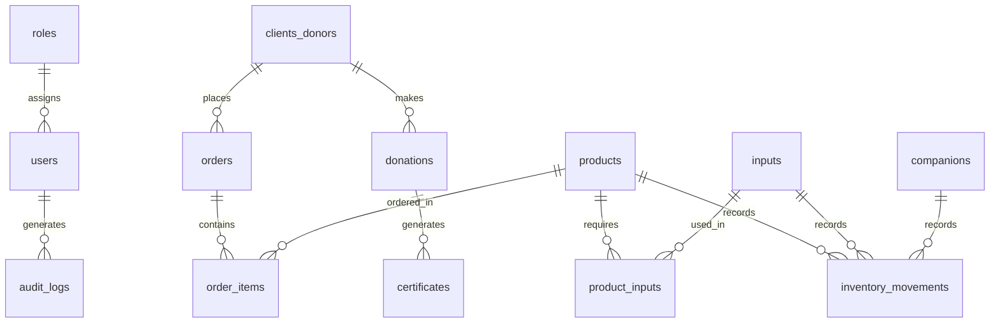

# Desglose Técnico de Estimación por Entregas - Propuesta 2
## Cliente: Fundación Infantil Santiago Corazón
## Consultor/Dev: Daniel Jaime Florez Aguirre
*   **Plazo Total:** 5 Meses (20 Semanas)
*   **Stack:** Angular | Node.js (NestJS/Express) o Python (FastAPI) | PostgreSQL Dedicado

Este documento detalla el plan de entregas y el alcance técnico de cada fase, especificando el **diseño de base de datos**, **endpoints de la API**, **módulos de Angular**, **pruebas de aceptación** e **integraciones del inventario** en cada una de las 5 entregas del proyecto.

---

## 1. Mapa General de Base de Datos (PostgreSQL)
A continuación, se define el esquema relacional que se implementará y poblará a lo largo de las entregas:



---

## 2. Viabilidad y Análisis de Reemplazar Shopify por E-commerce Propio
Reemplazar Shopify por una tienda pública propia es **técnicamente viable**, pero tiene un impacto significativo en el alcance y los plazos. A continuación, se presenta un análisis comparativo para la toma de decisiones:

### Comparativo: Integrar Shopify vs. Tienda Propia a Medida

| Criterio | Integrar Shopify (Original) | Reemplazar Shopify (Desarrollo Propio) |
| :--- | :--- | :--- |
| **Tiempo de Desarrollo** | **Bajo:** Se usa la API/Webhooks de Shopify para recibir pedidos ya procesados. | **Alto (+8 a 10 semanas):** Requiere crear catálogo público, carrito, pasarela de pago, cupones, etc. |
| **Complejidad y Seguridad** | **Baja:** Shopify gestiona la seguridad del checkout (PCI-DSS) y disponibilidad del servidor. | **Alta:** El servidor propio debe ser seguro y robusto para gestionar transacciones de pago. |
| **Administración del Catálogo** | Interfaz nativa de Shopify (muy amigable para el usuario). | Debe desarrollarse un panel de administración a medida para subir fotos, tallas, variantes, etc. |

### Alternativas Recomendadas para la Venta Online
*   **Opción A (Recomendada - Mantener Shopify + API):** Mantener Shopify para la tienda pública y conectar los pedidos automáticamente al backend corporativo (PostgreSQL) usando Webhooks para la administración interna de inventario, CRM y certificados.
*   **Opción B (Tienda Headless):** Tienda pública en Angular consumiendo la API de Shopify.
*   **Opción C (Desarrollo Propio Completo):** Eliminar Shopify y desarrollar el e-commerce a medida. Requiere **incrementar el plazo del proyecto en 2 meses adicionales**.

---

## 3. Mapa de Arquitectura Corporativa (Con PostgreSQL Propio y Angular)

```mermaid
graph TD
    subgraph Frontend Público (Donantes y Compradores)
        ShopifyStore[Tienda Shopify / Checkout Seguro]
    end

    subgraph Plataforma Central (Servidor Propio / Nube)
        AngularAdmin[Panel Admin Angular] <-->|Rest API con JWT| API[API Backend NestJS / FastAPI]
        API <-->|Conexión Segura SQL| DB[(PostgreSQL Dedicado)]
        
        subgraph Lógica del Backend
            AuthService[Autenticación Custom JWT]
            RoleGuard[Control de Accesos RBAC]
            CronJobs[Tareas Programadas de Backups]
        end
    end

    subgraph Integraciones y Notificaciones
        ShopifyStore -->|Webhook: Pedido Creado| API
        Wompi[Wompi / PayU / Paypal] -->|Webhook: Pagos| API
        API -->|Notificaciones| WhatsApp[WhatsApp Business API]
        API -->|Envío de Certificados| SMTP[Servicio de Correo]
    end
    
    Access[(Access Histórico)] -->|Migración Única ETL| DB
```

---

## 4. Plan de Entregas y Hitos Técnicos (Roadmap de 20 Semanas)

El proyecto se estructura en **5 entregas funcionales**, vinculadas al cumplimiento de hitos de desarrollo técnicos:

### Entrega 1: Servidor, PostgreSQL Propio, Custom Auth y Estructura Angular (Semanas 1 a 4)
*   **Alcance:**
    *   Setup de la base de datos **PostgreSQL** en el servidor de producción/desarrollo.
    *   Desarrollo de las migraciones y esquema inicial de la base de datos (Tablas de usuarios, roles, clientes, pedidos, logs de auditoría).
    *   Desarrollo del **sistema de autenticación JWT** y encriptación de contraseñas en el Backend API.
    *   Estructura base del frontend en **Angular** con interceptores de tokens JWT, control de rutas y roles base.
*   **Entregable:** API con endpoints de login/registro funcionales y aplicación Angular inicial desplegada con inicio de sesión y restricciones de permisos por rol.
*   **Criterio de Aceptación:** No es posible consultar la base de datos ni las pantallas operativas sin un Token JWT válido. El backend encripta correctamente las contraseñas al crearse nuevos usuarios.

### Entrega 2: CRM, Registro de Pedidos y Script de Migración (Semanas 5 a 8)
*   **Alcance:**
    *   **CRM (Clientes y Donantes) en Angular:** Tablas interactivas, historial de transacciones y búsquedas.
    *   **Gestión de Pedidos Manuales:** Formularios interactivos para la tienda física y telemercadeo en Angular.
    *   Script ETL (Extract, Transform, Load) para migrar la base de datos histórica de Access al servidor PostgreSQL.
*   **Entregable:** Módulos de Clientes y Pedidos en la app web de Angular y base de datos con el histórico cargado y normalizado.
*   **Criterio de Aceptación:** Ejecución del script de migración exitoso con verificación de integridad de datos de Access a PostgreSQL. Creación exitosa de clientes y pedidos vinculados.

### Entrega 3: Integraciones de Ingresos (Shopify/Pasarelas) y Certificados (Semanas 9 a 12)
*   **Alcance:**
    *   Desarrollo de endpoints de captura de Webhooks de Shopify para pedidos y de Wompi / PayU / Paypal para donaciones.
    *   Servicio de generación de PDF en backend para certificados de donación con firma y consecutivos.
    *   Servicio de correo saliente SMTP para envíos automáticos.
*   **Entregable:** Panel de logs de sincronización de pasarelas en Angular y automatización de envío de certificados funcionando en segundo plano.
*   **Criterio de Aceptación:** Una transacción simulada en Wompi o pedido en Shopify crea el registro en PostgreSQL en menos de 5 segundos, genera el certificado PDF y lo envía al correo del usuario automáticamente.

### Entrega 4: Control de Inventarios Pro y Notificaciones de WhatsApp (Semanas 13 a 16)
*   **Alcance:**
    *   **Módulo de Inventario en Angular:** Control de insumos, stock de productos terminados, acompañantes y alertas de reabastecimiento.
    *   Integración de stock con los pedidos entrantes (descuento dinámico).
    *   Integración con WhatsApp Business para notificar despachos y links de descarga de certificados.
*   **Entregable:** Pantallas de control de existencias en Angular y servicio API para el canal de WhatsApp.
*   **Criterio de Aceptación:** Un cambio a "En preparación" descuenta stock y sus respectivos insumos. Al enviarse, el cliente recibe un WhatsApp automático con la información.

### Entrega 5: Dashboards, Reporte Contable, Capacitación y Despliegue (Semanas 17 a 20)
*   **Alcance:**
    *   **Módulo de Reportes:** Gráficos financieros, de donaciones e inventarios en Angular.
    *   Visualización de mapa geográfico interactivo de impacto basado en direcciones de la base de datos PostgreSQL.
    *   Exportador de transacciones formateadas para importación contable en World Office.
    *   Capacitación grabada, documentación técnica y despliegue final en producción.
*   **Entregable:** Sistema desplegado y funcionando al 100% en los servidores definitivos del cliente, manual técnico y del usuario.
*   **Criterio de Aceptación:** Acta de entrega firmada tras validación final de todos los flujos de desarrollo integrados en producción.

---

## 5. Matriz de Cronograma y Control Técnico

| Entrega | Semana Límite | Hito Técnico de Aceptación |
| :---: | :---: | :--- |
| **1** | Semana 4 | Servidor Postgres activo + Auth JWT segura + Skeleton Angular. |
| **2** | Semana 8 | CRM operando + Carga exitosa de base de datos histórica de Access. |
| **3** | Semana 12 | Webhooks activos (Shopify/Wompi) + Generador automático de certificados PDF + SMTP. |
| **4** | Semana 16 | Descuento automático de stock (Productos/Insumos) + Envío de WhatsApp automático. |
| **5** | Semana 20 | Gráficos e indicadores web + Mapa de geolocalización + Exportador contable a World Office. |

---

## 6. Matriz de Riesgos y Compromisos del Cliente
Para cumplir estrictamente con el cronograma de 5 meses, se requiere el compromiso de la Fundación en los siguientes tiempos:
1.  **Semana 2 (Mes 1):** Entrega de las credenciales de los servidores (hosting/VPS y base de datos) y acceso de lectura a Shopify y Wompi.
2.  **Semana 5 (Mes 2):** Entrega de la base de datos Microsoft Access actual para iniciar el proceso de migración y homologación de datos.
3.  **Semana 13 (Mes 4):** Aprobación de la cuenta de Meta Developer para el uso de la API de WhatsApp Business.

---

## 7. Glosario de Términos (Para Personal No Técnico)
Para facilitar la lectura y el entendimiento por parte de los directivos de la Fundación, a continuación se detallan de forma sencilla los términos técnicos utilizados en este plan:

*   **Angular:** El framework (herramienta de desarrollo) que usaremos para construir la interfaz visual interactiva que verán los usuarios en sus pantallas (botones, formularios, tablas).
*   **Backend (API):** La parte oculta del sistema que corre en el servidor. Es el "cerebro" del software, encargado de procesar la lógica de negocio, validar la seguridad y conectar el sistema con las bases de datos u otros servicios.
*   **PostgreSQL:** Un motor de base de datos profesional y de código abierto. Funciona como un gran archivador digital ultra seguro y estructurado donde se guarda de forma permanente la información de clientes, pedidos, inventario y logs.
*   **JWT (JSON Web Token):** Es como un pase digital de seguridad. Cuando un usuario inicia sesión correctamente, el servidor le otorga este pase con el cual puede realizar acciones dentro del sistema de forma segura, garantizando que nadie suplante su identidad.
*   **Webhook:** Una notificación automática entre sistemas. Por ejemplo, cuando se compra algo en Shopify, Shopify utiliza un Webhook para "tocarle la puerta" a nuestro sistema y decirle instantáneamente: *"Oye, creé un nuevo pedido, aquí están los datos"*.
*   **ETL (Extract, Transform, Load):** El proceso técnico de migración de datos. Significa extraer los datos históricos de Access, transformarlos y limpiarlos para corregir errores, y finalmente cargarlos en la nueva base de datos PostgreSQL.
*   **API (Interfaz de Programación de Aplicaciones):** Un puente de comunicación digital que permite que dos sistemas diferentes hablen entre sí (por ejemplo, el puente entre nuestro software y la pasarela de pagos Wompi).
*   **Bcrypt:** Una tecnología de encriptación que transforma las contraseñas de los usuarios en un texto indescifrable. Así, si alguien malintencionado accediera al servidor, las contraseñas seguirían siendo totalmente ilegibles y seguras.
*   **RBAC (Control de Acceso Basado en Roles):** Reglas de seguridad que definen qué puede ver y hacer cada usuario según su puesto de trabajo (por ejemplo, un operador de tienda solo ve inventario y pedidos, mientras que el director financiero puede ver dashboards globales).
*   **Servidor VPS / Cloud:** Una computadora virtual de alto rendimiento rentada en internet (la nube) que se mantiene encendida las 24 horas del día, garantizando que el sistema siempre esté disponible para su uso.
*   **SMTP:** El protocolo estándar de internet utilizado para el envío de correos electrónicos automáticos desde el software (como los correos que adjuntan los certificados de donación en PDF).
